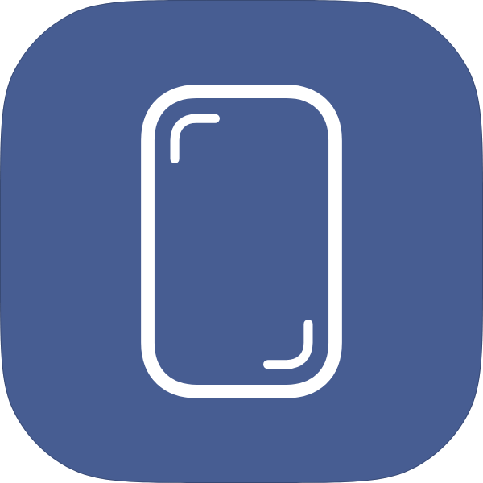
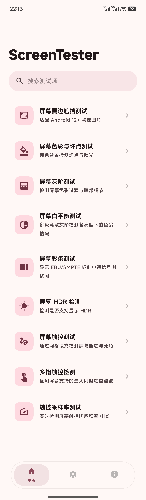
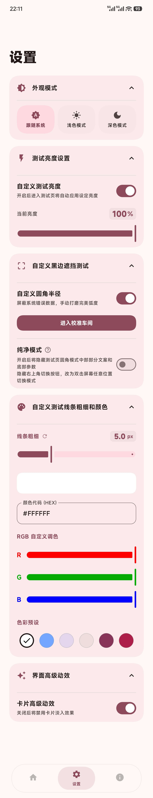
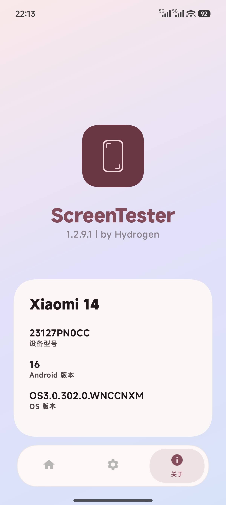
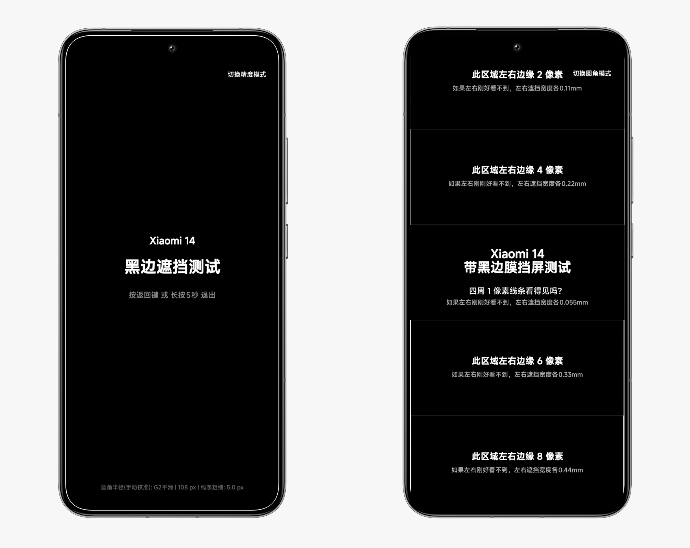

# ScreenTester

  

  <strong>一款适用于 Android 的钢化膜黑边遮挡测试软件</strong>

  
  
  
  

---

## 📖 项目简介

**ScreenTester** 是专为 Android 设备打造的钢化膜黑边遮挡测试应用。

全线基于 **Jetpack Compose** 现代化声明式 UI 架构开发，遵循 **Material 3** 设计规范，并深度融合了 Android 系统的 **Monet 动态色彩美学**，让每一次测试与调校都变成一场视觉享受。 

本应用使用AI开发

测试设备：**Xiaomi 14**，**HyperOS 3.0.302**，**Android 16**

该版本为Lite版 适用于 Android 7+ 的设备，如您的 Android 版本为 Android 12+ 建议下载[完整版](https://github.com/byHydrogen/ScreenTester/releases)获取全部功能

---

## 🌟 核心亮点功能

### 📐 黑边遮挡测试 (特色功能)
* **圆角校准**：拖动滑块手动调整至贴合屏幕圆角
* **高精度双模式切换**：
    * **圆角模式**：查看钢化膜黑边是否遮挡屏幕圆角
    * **精度模式**：独创分级像素检测线，不仅能看出是否遮挡，更能**直接精准量化出黑边阻挡的物理宽度（最高可精确到 0.055mm）**，让劣质缩水钢化膜无处遁形！
* **高度自定义参数**：测试线条粗细、动态颜色随心调整，确保在任何色彩背景下都能清晰辨别。

---

## 🛠️ 技术栈 (Tech Stack)

项目完全采用现代化 Android 核心技术栈构建：

* **开发语言**：Kotlin 🚀
* **UI 框架**：Jetpack Compose (声明式组件化开发)
* **设计规范**：Material Design 3 + Monet 动态色彩
* **生命周期**：Jetpack Activity / ViewModel
* **构建工具**：Gradle (Kotlin DSL)

---

## 📸 界面预览 (Screenshots)

|                  主页                   | 设置页 | 关于页 | 黑边遮挡测试页 |
|:-------------------------------------:| :---: | :---: | :---: |
|  |  |  |  |

---

## 📦 下载与安装

你可以前往本仓库的 [Releases](../../releases) 页面，下载最新 `APK` 安装包安装体验。

## 📄 开源协议
本项目采用 MIT License 开源协议。你可以自由地学习、修改和分发代码。

⭐️ 如果你喜欢这个项目，请帮我点一个 Star 🌟，这是对我最大的鼓励！
